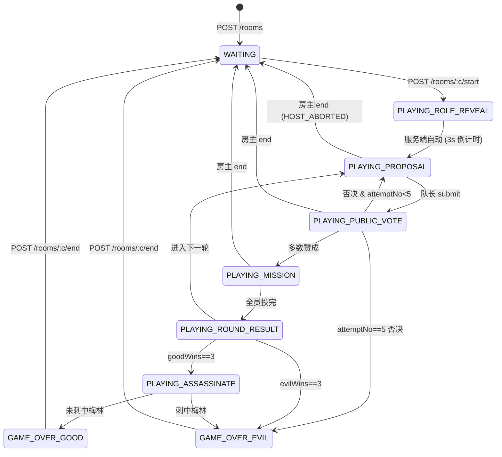

# Avalon Development Guide (v1)

本文档是阿瓦隆（Avalon）游戏功能在后端的权威开发文档，规则、协议、数据模型、验收标准都以本文为准。

实现 PR 需以本文为蓝本拆分；产品口径变更需先回写本文档再改代码。

> 配套前端文档：[`nightdeal-minip/docs/AVALON-FRONTEND.md`](https://github.com/kaiwenyao/nightdeal-minip/blob/docs/avalon-development/docs/AVALON-FRONTEND.md)

---

## 1. 当前范围 (Scope)

### 1.1 v1 包含

- 5–10 人桌
- 8 个经典角色：梅林、派西维尔、忠臣、莫德雷德、莫甘娜、奥伯伦、刺客、爪牙
- 5 轮任务（每轮含组队提案 → 全体公投 → 任务执行）
- 同一轮 5 次否决直接判负规则
- 蓝方累计赢 3 轮触发刺客刺杀梅林
- 断线重连：通过 `GET /api/rooms/:code/avalon/state` 拉本人视角快照
- 房主结束游戏复用通用 `POST /api/rooms/:code/end`

### 1.2 v1 不包含（"非本期范围"）

| 功能 | 处理方式 |
| --- | --- |
| 湖中仙女令牌 | 预留 schema 字段 `ladyOfTheLakeSeat` 但本期不实现 |
| 王者之剑 | 不实现，前后端无相关字段 |
| 目标牌（Targeting Cards） | 不实现 |
| 观战 / 旁观席 | 不实现 |
| 再来一局快捷接口 | 不实现，复用 end → start |

### 1.3 兼容性约束

- **不引入新 `GameType`**，继续复用 `GameType.AVALON`
- **不破坏既有 `room:state` / `room:started` / `room:ended` 协议**
- **不修改 `Room` / `RoomPlayer` / `GameRecord` 已有字段**，仅新增 model
- **不修改通用房间生命周期**（创建 / 加入 / 离开 / 踢人 / Cron 清理）

---

## 2. 阿瓦隆游戏规则（产品 + 开发真值源）

### 2.1 阵营

| 阵营 | 颜色 | 胜利条件 |
| --- | --- | --- |
| 好人 | 蓝方 (GOOD) | 任务赢 3 轮**且**刺客未刺中梅林 |
| 坏人 | 红方 (EVIL) | 任务赢 3 轮 **或** 蓝方赢 3 轮后刺客刺中梅林 **或** 同一轮连续 5 次提案被否 |

### 2.2 角色定义与视野

| 角色 | 阵营 | 视野说明 |
| --- | --- | --- |
| 梅林 (Merlin) | GOOD | 看见所有红方（**奥伯伦除外**） |
| 派西维尔 (Percival) | GOOD | 看见梅林 + 莫甘娜，但**两人身份不分** |
| 忠臣 (Loyal Servant) | GOOD | 无视野 |
| 莫德雷德 (Mordred) | EVIL | 看见同伴；**对梅林隐身** |
| 莫甘娜 (Morgana) | EVIL | 看见同伴；对派西维尔显示为"梅林或莫甘娜"之一 |
| 奥伯伦 (Oberon) | EVIL | **不看同伴，同伴也不看 ta**；对梅林可见 |
| 刺客 (Assassin) | EVIL | 看见同伴（除奥伯伦）；游戏末尾负责刺杀梅林 |
| 爪牙 (Minion) | EVIL | 看见同伴（除奥伯伦） |

视野矩阵（行 = 观察者，列 = 被观察者，✓ = 知道是红方，M = 标记为"梅林/莫甘娜之一"）：

| 观察者 \ 目标 | 梅林 | 派西维尔 | 忠臣 | 莫德雷德 | 莫甘娜 | 奥伯伦 | 刺客 | 爪牙 |
| --- | --- | --- | --- | --- | --- | --- | --- | --- |
| **梅林** | – | – | – |   | ✓ |   | ✓ | ✓ |
| **派西维尔** | M | – | – |   | M |   |   |   |
| **莫德雷德** |   |   |   | – | ✓ |   | ✓ | ✓ |
| **莫甘娜** |   |   |   | ✓ | – |   | ✓ | ✓ |
| **奥伯伦** |   |   |   |   |   | – |   |   |
| **刺客** |   |   |   | ✓ | ✓ |   | – | ✓ |
| **爪牙** |   |   |   | ✓ | ✓ |   | ✓ | – |

### 2.3 人数与角色配置表（官方表）

| 总人数 | 蓝方 | 红方 | 默认配置（必含） | 可选额外 |
| --- | --- | --- | --- | --- |
| 5 | 3 | 2 | 梅林 + 2 忠臣 + 刺客 + 莫甘娜 | – |
| 6 | 4 | 2 | 梅林 + 3 忠臣 + 刺客 + 莫甘娜 | 派西维尔（替换 1 忠臣） |
| 7 | 4 | 3 | 梅林 + 3 忠臣 + 刺客 + 莫甘娜 + 奥伯伦 | 派西维尔（替换 1 忠臣） |
| 8 | 5 | 3 | 梅林 + 4 忠臣 + 刺客 + 莫甘娜 + 1 爪牙 | 派西维尔、莫德雷德 |
| 9 | 6 | 3 | 梅林 + 5 忠臣 + 刺客 + 莫甘娜 + 莫德雷德 | 派西维尔、奥伯伦 |
| 10 | 6 | 4 | 梅林 + 5 忠臣 + 刺客 + 莫甘娜 + 莫德雷德 + 1 爪牙 | 派西维尔、奥伯伦 |

校验硬性规则：
- **必含**：梅林、刺客
- 红方人数等于上表
- 派西维尔 / 莫甘娜 / 莫德雷德 / 奥伯伦 / 爪牙 总数 + 梅林 + 刺客 + 忠臣 = 总人数
- 红方角色 + 爪牙 = 红方人数

### 2.4 任务人数 & 失败票阈值

每轮派出人数表：

| 轮次 \ 总人数 | 5 | 6 | 7 | 8 | 9 | 10 |
| --- | --- | --- | --- | --- | --- | --- |
| 第 1 轮 | 2 | 2 | 2 | 3 | 3 | 3 |
| 第 2 轮 | 3 | 3 | 3 | 4 | 4 | 4 |
| 第 3 轮 | 2 | 4 | 3 | 4 | 4 | 4 |
| 第 4 轮 | 3 | 3 | 4 | 5 | 5 | 5 |
| 第 5 轮 | 3 | 4 | 4 | 5 | 5 | 5 |

**第 4 轮在 7 人及以上桌需要 2 张失败票才算失败**；其他轮次只需 1 张。

服务端常量表（实现时单独抽出，不要散落代码各处）：

```ts
const TEAM_SIZE: Record<number, [number, number, number, number, number]> = {
  5:  [2, 3, 2, 3, 3],
  6:  [2, 3, 4, 3, 4],
  7:  [2, 3, 3, 4, 4],
  8:  [3, 4, 4, 5, 5],
  9:  [3, 4, 4, 5, 5],
  10: [3, 4, 4, 5, 5],
};

function requiredFails(playerCount: number, round: number): number {
  return playerCount >= 7 && round === 4 ? 2 : 1;
}
```

### 2.5 单轮子阶段

```
PROPOSAL (队长选 N 名候选人)
  ↓ 队长 submit
PUBLIC_VOTE (所有玩家投赞成 / 反对)
  ↓ 全员投完
  ├─ 多数赞成 (>50%, 平票视为否决) → MISSION
  └─ 否决 → 队长后移一人 → 下一次提案 (同一轮 attemptNo +1)
       └─ attemptNo 达到 5 → GAME_OVER (winnerSide = EVIL, reason = FIVE_REJECTIONS)
MISSION (候选人投成功 / 失败；蓝方禁选失败)
  ↓ 全员投完
ROUND_RESULT (结算 失败票 vs requiredFails)
  ↓ 切换队长
  ├─ goodWins == 3 → ASSASSINATE
  ├─ evilWins == 3 → GAME_OVER (winnerSide = EVIL, reason = THREE_FAILED_MISSIONS)
  └─ 否则进入第 N+1 轮 PROPOSAL
ASSASSINATE (刺客指定 1 名玩家)
  ↓
GAME_OVER (winnerSide = isMerlin ? EVIL : GOOD, reason = ASSASSINATION_*)
```

### 2.6 边界情况裁定

| 场景 | 裁定 |
| --- | --- |
| 公投平票 (赞成 == 反对) | **视为否决**，attemptNo +1 |
| 同一轮第 5 次提案 | 仍按正常 PROPOSAL → PUBLIC_VOTE 流程，但**不允许否决**（直接判 EVIL 胜整局，无须公投） |
| 队长在 PROPOSAL 阶段断线超 60s | 自动 fast-forward：当前 attempt 视为否决，attemptNo +1，队长继续后移 |
| 候选人在 MISSION 阶段断线超 60s | 蓝方默投成功 / 红方默投失败（避免红方拖延） |
| 普通玩家 PUBLIC_VOTE 阶段断线超 60s | 视为反对 |
| 刺客在 ASSASSINATE 阶段断线超 60s | 蓝方直接获胜（守护梅林） |
| 房主提前调用 `POST /api/rooms/:code/end` | 房间立即回到 `WAITING`，写 `AvalonGame.endedAt`，`winnerSide = null`、`winnerReason = HOST_ABORTED` |

---

## 3. 数据模型 (Prisma)

### 3.1 复用现有 model

| Model | 复用方式 |
| --- | --- |
| `Room` | 不变。`gameType = AVALON` 触发 Avalon 流程 |
| `RoomPlayer` | 不变。`role` 字段保存中文角色名（与 `role-assigner.ts` 当前一致） |
| `GameRecord` | 不变。每局开局插一行，结束时回写 `endedAt` |

### 3.2 新增 model（实现 PR 时落库）

```prisma
model AvalonGame {
  id                       String           @id @default(cuid())
  gameRecordId             String           @unique
  status                   AvalonGameStatus @default(IN_PROGRESS)
  phase                    AvalonPhase      @default(ROLE_REVEAL)
  currentRound             Int              @default(1)         // 1..5
  currentLeaderSeat        Int                                  // 当前队长座位
  failedProposalsInRound   Int              @default(0)         // 0..4
  goodWins                 Int              @default(0)         // 0..3
  evilWins                 Int              @default(0)         // 0..3
  ladyOfTheLakeSeat        Int?                                 // 预留，v1 不写
  assassinTargetSeat       Int?                                 // 刺杀目标
  winnerSide               AvalonSide?                          // GOOD / EVIL / null(进行中)
  winnerReason             String?                              // ASSASSINATION_HIT / ASSASSINATION_MISS / THREE_FAILED_MISSIONS / FIVE_REJECTIONS / HOST_ABORTED
  startedAt                DateTime         @default(now())
  endedAt                  DateTime?

  gameRecord               GameRecord       @relation(fields: [gameRecordId], references: [id], onDelete: Cascade)
  rounds                   AvalonRound[]

  @@index([status])
  @@map("avalon_games")
}

model AvalonRound {
  id              String           @id @default(cuid())
  gameId          String
  roundNo         Int                                          // 1..5
  teamSize        Int                                          // 派出人数
  requiredFails   Int                                          // 1 或 2
  result          AvalonRoundResult?                           // SUCCESS / FAIL
  failVoteCount   Int?                                         // 揭晓后写入
  startedAt       DateTime         @default(now())
  endedAt         DateTime?

  game            AvalonGame       @relation(fields: [gameId], references: [id], onDelete: Cascade)
  proposals       AvalonProposal[]
  missionVotes    AvalonMissionVote[]

  @@unique([gameId, roundNo])
  @@map("avalon_rounds")
}

model AvalonProposal {
  id              String   @id @default(cuid())
  roundId         String
  attemptNo       Int                                          // 1..5
  leaderSeat      Int
  memberSeats     Int[]                                         // Postgres int[]
  approved        Boolean?                                     // null = 未公投完，true/false = 揭晓后写入
  publishedAt     DateTime?

  round           AvalonRound  @relation(fields: [roundId], references: [id], onDelete: Cascade)
  votes           AvalonProposalVote[]

  @@unique([roundId, attemptNo])
  @@index([roundId])
  @@map("avalon_proposals")
}

model AvalonProposalVote {
  id           String   @id @default(cuid())
  proposalId   String
  userId       String
  seatNo       Int
  approve      Boolean
  votedAt      DateTime @default(now())

  proposal     AvalonProposal @relation(fields: [proposalId], references: [id], onDelete: Cascade)

  @@unique([proposalId, userId])
  @@index([proposalId])
  @@map("avalon_proposal_votes")
}

model AvalonMissionVote {
  id           String   @id @default(cuid())
  roundId      String
  userId       String
  seatNo       Int
  success      Boolean
  votedAt      DateTime @default(now())

  round        AvalonRound  @relation(fields: [roundId], references: [id], onDelete: Cascade)

  @@unique([roundId, userId])
  @@index([roundId])
  @@map("avalon_mission_votes")
}

enum AvalonGameStatus { IN_PROGRESS FINISHED ABORTED }
enum AvalonPhase      { ROLE_REVEAL PROPOSAL PUBLIC_VOTE MISSION ROUND_RESULT ASSASSINATE GAME_OVER }
enum AvalonSide       { GOOD EVIL }
enum AvalonRoundResult{ SUCCESS FAIL }
```

### 3.3 索引与约束设计意图

- `AvalonGame.gameRecordId UNIQUE` → 一局对应一个 GameRecord
- `AvalonRound(gameId, roundNo) UNIQUE` → 防止同一局插入重复轮
- `AvalonProposal(roundId, attemptNo) UNIQUE` → 防止同一轮提案号重复
- `AvalonProposalVote(proposalId, userId) UNIQUE` → 防止同一玩家在同一提案上重复投票（**作弊防护核心**）
- `AvalonMissionVote(roundId, userId) UNIQUE` → 同上
- 所有外键 `onDelete: Cascade`：房间删除时清理整局数据

### 3.4 身份字段

玩家身份只读 `RoomPlayer.role`，**不在 AvalonGame 上重复存身份**。这避免了开局时双写不一致，也避免在 `room:state` 公开广播里意外泄漏。

---

## 4. 状态机

### 4.1 房间层 + 对局层联合状态机



### 4.2 阶段允许的操作

| 阶段 | 可发起的客户端事件 | 发起方限制 |
| --- | --- | --- |
| `ROLE_REVEAL` | – | 服务端自动推进 |
| `PROPOSAL` | `avalon:proposal:submit` | 仅 `currentLeaderSeat` |
| `PUBLIC_VOTE` | `avalon:vote:public` | 房间内全部玩家（每人一次） |
| `MISSION` | `avalon:vote:mission` | 仅当前 proposal `memberSeats` 内的玩家（每人一次） |
| `ROUND_RESULT` | – | 服务端自动推进 |
| `ASSASSINATE` | `avalon:assassinate` | 仅刺客 |
| `GAME_OVER` | – | 仅房主 `room:end` 可以回 `WAITING` |

任何在错误阶段的调用 → 返回 `PHASE_MISMATCH` 错误。

---

## 5. 角色配置校验扩展

现有 `roleConfigSchema` (file: `src/room/role-config.schema.ts`) **不变**。`AvalonRoleValidator` 在房主调用 `POST /rooms/:code/start` 时执行下列校验，任一失败返回 HTTP 400 + 业务码 40001：

```ts
function validateAvalonStart(playerCount: number, cfg: RoleConfig): void {
  // 1. 必含
  if (!cfg.merlin) throw new BadRequest('AVALON_MERLIN_REQUIRED');
  if (!cfg.assassin) throw new BadRequest('AVALON_ASSASSIN_REQUIRED');

  // 2. 红方人数匹配
  const evil = (cfg.assassin ? 1 : 0) + (cfg.morgana ? 1 : 0)
             + (cfg.mordred ? 1 : 0) + (cfg.oberon ? 1 : 0)
             + cfg.minions;
  const expectedEvil = EVIL_COUNT_TABLE[playerCount];
  if (evil !== expectedEvil) throw new BadRequest('AVALON_EVIL_COUNT_MISMATCH');

  // 3. 总数匹配
  const good = 1 + (cfg.percival ? 1 : 0) + cfg.loyalServants;
  if (good + evil !== playerCount) throw new BadRequest('AVALON_TOTAL_MISMATCH');

  // 4. 派西维尔需要莫甘娜配对（否则视野规则失效）
  if (cfg.percival && !cfg.morgana) throw new BadRequest('AVALON_PERCIVAL_NEEDS_MORGANA');

  // 5. 人数下限
  if (playerCount < 5 || playerCount > 10) throw new BadRequest('AVALON_PLAYER_COUNT_OUT_OF_RANGE');
}

const EVIL_COUNT_TABLE: Record<number, number> = {
  5: 2, 6: 2, 7: 3, 8: 3, 9: 3, 10: 4,
};
```

校验位置：
- `RoomService.updateRoomSettings` 时只校验 1 / 4 / 5（允许 WAITING 阶段配置不完整）
- `RoomService.startGame` 时校验全部 1–5

---

## 6. REST API（增量）

所有接口前缀 `/api`，统一 envelope `{ code, message, data }`，错误码沿用 `src/common/filters/http-exception.filter.ts`。所有接口需 `Authorization: Bearer <token>`。

### 6.1 GET /api/rooms/:code/avalon/state

拉取**本人视角**的对局完整快照，用于断线重连或后台切前台。

**响应：**

```json
{
  "code": 0,
  "message": "success",
  "data": {
    "phase": "MISSION",
    "round": 2,
    "attemptNo": 1,
    "currentLeaderSeat": 3,
    "failedProposalsInRound": 0,
    "score": { "good": 1, "evil": 0 },
    "myRole": "梅林",
    "mySide": "GOOD",
    "myVision": [
      { "seatNo": 5, "label": "EVIL" },
      { "seatNo": 7, "label": "EVIL" }
    ],
    "currentProposal": {
      "leaderSeat": 3,
      "memberSeats": [3, 5, 6],
      "iAmMember": false,
      "myMissionVote": null
    },
    "history": [
      {
        "round": 1,
        "result": "SUCCESS",
        "failVoteCount": 0,
        "proposals": [
          { "attemptNo": 1, "leaderSeat": 1, "memberSeats": [1, 2], "approved": false,
            "votes": [{"seat":1,"approve":true},{"seat":2,"approve":false}] },
          { "attemptNo": 2, "leaderSeat": 2, "memberSeats": [2, 4], "approved": true,
            "votes": [] }
        ]
      }
    ]
  }
}
```

字段说明：
- `myVision` 服务端按 §2.2 视野矩阵裁剪，**不能返回不应看到的角色**
- `currentProposal.iAmMember` 仅在 `phase === MISSION` 时有意义
- `currentProposal.myMissionVote` 服务端只回当前用户自己的投票，其他人为 `null`
- `history.proposals[].votes` **公开**所有玩家的公投结果（公投本就是公开的）
- `history.proposals[].votes` 不含 mission 投票（mission 永远只看汇总）

**错误：**

| HTTP | code | 含义 |
| --- | --- | --- |
| 404 | 40401 | 房间不存在 / 房间不在 PLAYING / 用户不在房间 |
| 401 | 40101 | Token 无效 |

**幂等：** 是。可任意频次调用。

### 6.2 POST /api/rooms/:code/avalon/proposal

队长提交组队提案。

**请求：**

```http
POST /api/rooms/ABCDEF/avalon/proposal
Content-Type: application/json
Authorization: Bearer <token>

{ "memberSeats": [3, 5, 6] }
```

**响应：**

```json
{ "code": 0, "message": "success", "data": { "attemptNo": 1 } }
```

**校验：**
- 阶段必须为 `PROPOSAL`
- 调用者 `seatNo` 必须等于 `currentLeaderSeat`
- `memberSeats.length` 必须等于本轮 `teamSize`
- `memberSeats` 元素互不重复，且都在 `[1..maxPlayers]`
- 同 attemptNo 重复提交：以**最后一次为准**（前提仍是同一队长 / 同阶段），用 `AvalonProposal(roundId, attemptNo)` upsert

**错误码：**

| 业务码 | WS 错误名 |
| --- | --- |
| 40901 | `PHASE_MISMATCH` |
| 40301 | `NOT_LEADER` |
| 40001 | `INVALID_TEAM_SIZE` |

### 6.3 POST /api/rooms/:code/avalon/public-vote

全体公投。

**请求：**

```json
{ "approve": true }
```

**响应：**

```json
{ "code": 0, "message": "success", "data": { "voted": 4, "total": 7 } }
```

**校验：**
- 阶段必须为 `PUBLIC_VOTE`
- 调用者必须在房间内
- `(proposalId, userId)` 唯一约束兜底，重复投返回 `ALREADY_VOTED`

### 6.4 POST /api/rooms/:code/avalon/mission-vote

任务执行投票。

**请求：**

```json
{ "success": true }
```

**校验：**
- 阶段必须为 `MISSION`
- 调用者 `seatNo` 必须在 `currentProposal.memberSeats` 中
- **若调用者 `mySide === GOOD` 且 `success === false` → 拒绝**，返回 `EVIL_REQUIRED_FOR_FAIL`
- `(roundId, userId)` 唯一约束兜底

### 6.5 POST /api/rooms/:code/avalon/assassinate

刺客指定刺杀目标。

**请求：**

```json
{ "targetSeat": 4 }
```

**响应：**

```json
{
  "code": 0, "message": "success",
  "data": { "isMerlin": true, "winnerSide": "EVIL", "winnerReason": "ASSASSINATION_HIT" }
}
```

**校验：**
- 阶段必须为 `ASSASSINATE`
- 调用者 `role === '刺客'`
- `targetSeat` 必须在 `[1..maxPlayers]` 且对应的 `RoomPlayer` 存在

### 6.6 与通用接口的关系

下列通用接口**无需改造**，本期复用：

| 接口 | Avalon 行为 |
| --- | --- |
| `POST /api/rooms` | 创建 Avalon 房间（`gameType: 'AVALON'`） |
| `POST /api/rooms/:c/join` | 加入 |
| `POST /api/rooms/:c/leave` | 离开（PLAYING 阶段离开走 §2.6 断线托管） |
| `POST /api/rooms/:c/start` | 开局（叠加 §5 校验） |
| `POST /api/rooms/:c/end` | 房主结束，写 `AvalonGame.endedAt + winnerReason=HOST_ABORTED` |
| `POST /api/rooms/:c/kick` | 仅 WAITING 阶段允许 |
| `PATCH /api/rooms/:c/settings` | 仅 WAITING 阶段允许 |
| `GET /api/rooms/:c` | 不返回 Avalon 对局明细（明细走 6.1） |
| `GET /api/rooms/:c/my-role` | 仅返回身份名（与现状一致） |

---

## 7. Socket.IO 协议（增量）

### 7.1 命名空间与命名规范

- 命名空间继续 `/room`
- 事件前缀严格区分：通用房间事件用 `room:`，Avalon 用 `avalon:`
- 个人事件通过 `to('user:' + userId).emit(...)` 单播（沿用现有模式）

### 7.2 客户端 → 服务端

| 事件 | Payload | 等价 REST |
| --- | --- | --- |
| `avalon:proposal:submit` | `{ roomCode, memberSeats }` | 6.2 |
| `avalon:vote:public` | `{ roomCode, approve }` | 6.3 |
| `avalon:vote:mission` | `{ roomCode, success }` | 6.4 |
| `avalon:assassinate` | `{ roomCode, targetSeat }` | 6.5 |

> **客户端策略**：默认走 WS（实时），断线重连后用 REST 6.1 拉快照修正。WS 与 REST 任选其一即可，不要同一动作双发。

### 7.3 服务端 → 客户端（广播）

| 事件 | Payload | 触发时机 |
| --- | --- | --- |
| `avalon:phase` | `{ phase, round, attemptNo, leaderSeat, failedProposalsInRound, score: { good, evil } }` | 任何阶段切换 |
| `avalon:proposal` | `{ leaderSeat, memberSeats, attemptNo, round }` | 队长提交后 |
| `avalon:public-vote:progress` | `{ voted, total }` | 每张公投票落地 |
| `avalon:public-vote:result` | `{ approved, votes: [{ seat, approve }] }` | 全员投完 |
| `avalon:mission-vote:progress` | `{ voted, total }` | 每张任务票落地 |
| `avalon:mission-vote:result` | `{ round, success, failVoteCount, requiredFails }` | 全员投完。**永不包含 voter 身份信息** |
| `avalon:assassinate:result` | `{ targetSeat, isMerlin }` | 刺客提交后 |
| `avalon:game-over` | `{ winnerSide, reason }` | 终局 |

### 7.4 服务端 → 客户端（个人单播）

| 事件 | Payload | 触发时机 |
| --- | --- | --- |
| `avalon:role-revealed` | `{ role, side, vision: [{ seatNo, label }] }` | 开局后逐个发给本人 |

> 现有 `room:started` 仍发送（仅含 `yourRole` 字符串），保留向后兼容。新前端忽略 `room:started.yourRole`，以 `avalon:role-revealed` 为准。

### 7.5 错误事件

```ts
socket.emit('avalon:error', {
  code: 'PHASE_MISMATCH' | 'NOT_LEADER' | 'NOT_MEMBER' | 'NOT_ASSASSIN'
      | 'INVALID_TEAM_SIZE' | 'EVIL_REQUIRED_FOR_FAIL' | 'ALREADY_VOTED' | 'GAME_ENDED',
  message: string,
  phase?: AvalonPhase,            // 服务端当前阶段（便于客户端纠正）
  expectedPhase?: AvalonPhase,    // 该操作期望的阶段
});
```

错误码 ↔ HTTP 业务码映射：

| WS 错误 | HTTP 业务码 | HTTP 状态 |
| --- | --- | --- |
| `PHASE_MISMATCH` | 40901 | 409 |
| `NOT_LEADER` / `NOT_MEMBER` / `NOT_ASSASSIN` | 40301 | 403 |
| `INVALID_TEAM_SIZE` / `EVIL_REQUIRED_FOR_FAIL` | 40001 | 400 |
| `ALREADY_VOTED` | 40901 | 409 |
| `GAME_ENDED` | 40401 | 404 |

### 7.6 事件时序示意

一轮成功任务：

```
[Server]  avalon:phase {phase:PROPOSAL, round:1, leaderSeat:1}
[Client→] avalon:proposal:submit {memberSeats:[1,2]}
[Server]  avalon:proposal {leaderSeat:1, memberSeats:[1,2], attemptNo:1}
[Server]  avalon:phase {phase:PUBLIC_VOTE, ...}
[Client→] avalon:vote:public {approve:true}  × N 次
[Server]  avalon:public-vote:progress {voted:1,total:5} ... {voted:5,total:5}
[Server]  avalon:public-vote:result {approved:true, votes:[...]}
[Server]  avalon:phase {phase:MISSION, ...}
[Client→] avalon:vote:mission {success:true}  × teamSize 次
[Server]  avalon:mission-vote:progress {voted:1,total:2} ... {voted:2,total:2}
[Server]  avalon:mission-vote:result {round:1, success:true, failVoteCount:0, requiredFails:1}
[Server]  avalon:phase {phase:PROPOSAL, round:2, leaderSeat:2, score:{good:1,evil:0}}
```

---

## 8. Redis 用法（增量）

| Key | 类型 | TTL | 用途 |
| --- | --- | --- | --- |
| `room:{code}:avalon:phase` | string | 1h | 当前阶段缓存（避免高频读 Postgres） |
| `room:{code}:avalon:vote:public:{proposalId}` | set of userId | 30min | 已投玩家集合，用于进度推送 + 防重 |
| `room:{code}:avalon:vote:mission:{roundId}` | set of userId | 30min | 同上 |
| `room:{code}:avalon:offline-grace:{userId}` | timestamp | 60s | 断线托管倒计时（§2.6） |

**绝不在 Redis 存的内容：**

- 玩家身份 / 阵营
- 任意一张公投或任务票的具体内容
- 视野（myVision）

理由：Redis 客户端可能被运维误用 `KEYS *` / `MONITOR` 排查问题时意外打印。所有敏感数据走 Postgres + 服务端按用户 ID 二次裁剪后下发。

---

## 9. 并发与作弊防护

### 9.1 投票原子性

所有投票接口必须用 `prisma.$transaction`：

```ts
await prisma.$transaction(async (tx) => {
  // 1. 锁 AvalonGame 行（SELECT FOR UPDATE）
  const game = await tx.$queryRaw`SELECT * FROM avalon_games WHERE id = ${gameId} FOR UPDATE`;

  // 2. 校验阶段
  if (game.phase !== 'PUBLIC_VOTE') throw new PhaseMismatch();

  // 3. 插票（唯一约束兜底）
  await tx.avalonProposalVote.create({ data: { proposalId, userId, seatNo, approve } });

  // 4. 检查是否全员投完，若是则推进阶段
  const voted = await tx.avalonProposalVote.count({ where: { proposalId } });
  if (voted === game.playerCount) {
    // 计票 + 推进 phase + 写 approved
  }
});
```

### 9.2 限流叠加

- 复用 `RoomGateway` 现有 `ws-rate:user:{userId}` 限流（10 次/秒）
- 业务层额外约束：**同一 (proposalId, userId) 或 (roundId, userId) 只接受第一次投票**，第二次返回 `ALREADY_VOTED`（不计入限流，避免被恶意刷限流）

### 9.3 信息泄漏防护

| 风险 | 防护 |
| --- | --- |
| `room:state` 误带身份 | 公开广播 payload schema 必须**显式列字段**，禁用 `select: '*'` 或直接 `JSON.stringify(player)` |
| mission 投票泄漏投票人 | `avalon:mission-vote:result` payload **不含 userId / seatNo** 字段；DB 层有，不广播 |
| 视野接口越权 | 6.1 / `avalon:role-revealed` 只读取 `req.user.id`，禁止接受 `?userId=` 查询参数 |
| 蓝方刷失败票绕过前端 | 服务端 6.4 强校验 `mySide === EVIL` |
| 提案中途泄漏公投进度内容 | `avalon:public-vote:progress` 只回 `{voted, total}`，揭晓事件单独触发 |

### 9.4 时序攻击

`mySide === GOOD && success === false` 的拒绝必须在**任何 DB 写入之前**完成，不要先 insert 再回滚（防止通过响应时间推断对手是否已投）。

---

## 10. 定时清理与异常

### 10.1 复用既有 Cron

- `cleanupOfflinePlayers` (5 min) — WAITING 状态下离线超 5 分钟移除玩家。**PLAYING 状态不动。**
- `cleanupIdleRooms` (10 min) — 30 分钟无活动删除房间，连带级联删除 `AvalonGame*`

### 10.2 新增 Cron：阶段超时托管

```ts
@Cron('*/30 * * * * *')  // 每 30s
async fastForwardOfflineActions() {
  // 扫描所有 phase=PLAYING 且 currentLeaderSeat / 候选人 / 刺客 离线超 60s 的房间
  // 按 §2.6 表格执行 fast-forward
}
```

### 10.3 异常恢复

- 服务进程重启：从 Postgres 重建状态，Redis 缓存惰性回填（首次访问时 `recomputePhase`）
- 数据库事务失败：`avalon:error` 返回 `code: 'INTERNAL'`（兜底，不在 §7.5 错误码表内），客户端提示「网络异常，请重试」

---

## 11. 测试要求

实现 PR 必须覆盖以下测试用例（沿用项目 `common/testing.md` 80% 覆盖率标准）：

### 11.1 单元测试

| 模块 | 用例 |
| --- | --- |
| `role-assigner.ts` | 5–10 人各组合的角色数 / 视野裁剪正确（已存在用例需扩展） |
| `avalon-validator.ts` | §5 五条规则各 1 个正例 + 1 个反例 |
| `team-size.ts` | 6 人 × 5 轮 / 10 人 × 5 轮 表查询 |
| `required-fails.ts` | 第 4 轮在 7+ 人桌返回 2，其他返回 1 |
| `vote-counter.ts` | 多数赞成 / 平票视为否决 / 全弃权视为否决 |

### 11.2 集成测试（mocked Postgres + Redis）

| 用例标题 | 描述 |
| --- | --- |
| `start game with invalid role config rejects` | §5 五个错误码各覆盖 |
| `non-leader cannot submit proposal` | `NOT_LEADER` |
| `proposal with wrong team size rejects` | `INVALID_TEAM_SIZE` |
| `5 consecutive rejections ends game with EVIL win` | `FIVE_REJECTIONS` |
| `good player cannot vote fail on mission` | `EVIL_REQUIRED_FOR_FAIL` |
| `4th mission with 7+ players requires 2 fails` | 1 张失败仍算 SUCCESS |
| `mission result does not include voter identities` | 断言 payload schema |
| `assassin hits merlin → EVIL wins` | `ASSASSINATION_HIT` |
| `assassin misses → GOOD wins` | `ASSASSINATION_MISS` |
| `room:state public broadcast contains no role` | 全字段断言 |
| `GET /avalon/state restores phase after disconnect` | 重连快照 |
| `concurrent duplicate vote rejected by unique constraint` | `ALREADY_VOTED` |
| `host POST /end during PLAYING aborts cleanly` | `HOST_ABORTED` |

### 11.3 E2E（可选，建议补）

启动完整 NestJS + 内存 Postgres + 内存 Redis，模拟 5 个 socket 客户端走完 1 局。

---

## 12. 验收标准（DoD）

实现 PR 合入前必须通过以下勾选清单：

- [ ] 5 人桌本地集成测试一局可走完（含 1 次否决、1 次成功任务、1 次失败任务、刺杀阶段）
- [ ] 同一房间多设备登录任一设备投票后，其他设备 WS 进度即时更新
- [ ] 服务端拒绝所有越权 / 越阶段调用并返回明确错误码（§7.5 全 8 项）
- [ ] 任务投票揭晓 payload 永远只含 `success / failVoteCount / requiredFails`，无 voter 字段
- [ ] `room:state` 公开广播不含身份与投票内容（自动化 schema 断言）
- [ ] §11 全部测试通过 + 覆盖率 ≥ 80%
- [ ] Prisma migration 可前后端独立部署（不依赖前端发版）
- [ ] 错误码全部进入 `src/common/filters/http-exception.filter.ts` 的统一表
- [ ] 文档与代码同 PR 不混在一起：本期只合开发文档

---

## 13. 后续可扩展（非本期范围占位）

| 功能 | 计划 |
| --- | --- |
| 湖中仙女 | schema 已留 `ladyOfTheLakeSeat`，下期补阶段 + 事件 |
| 王者之剑 | 第 4 / 5 轮加 OPTIONAL 阶段，队长可指定一名替代投票者 |
| 再来一局 | 新接口 `POST /api/rooms/:c/avalon/replay` 复用座位与角色配置 |
| 观战席 | `RoomPlayer.role = SPECTATOR`，禁所有写接口 |
| 战绩归档 | `AvalonGame` 已有 `endedAt + winnerSide`，前端做战绩页 |

---

## 14. 相关文档

- [`docs/SGS-DEVELOPMENT.md`](./SGS-DEVELOPMENT.md) — 房间公共能力 / 通用接口
- [`docs/wechat-auth.md`](./wechat-auth.md) — 微信登录与 JWT
- [`nightdeal-minip/docs/AVALON-FRONTEND.md`](https://github.com/kaiwenyao/nightdeal-minip/blob/docs/avalon-development/docs/AVALON-FRONTEND.md) — 小程序端开发文档
- 源码参考：
  - `src/room/role-assigner.ts` — 角色随机分配
  - `src/room/role-config.schema.ts` — RoleConfig Zod schema
  - `src/room/room.gateway.ts` — `/room` namespace 与事件命名
  - `src/room/room.service.ts` — 房间状态机与 Cron
